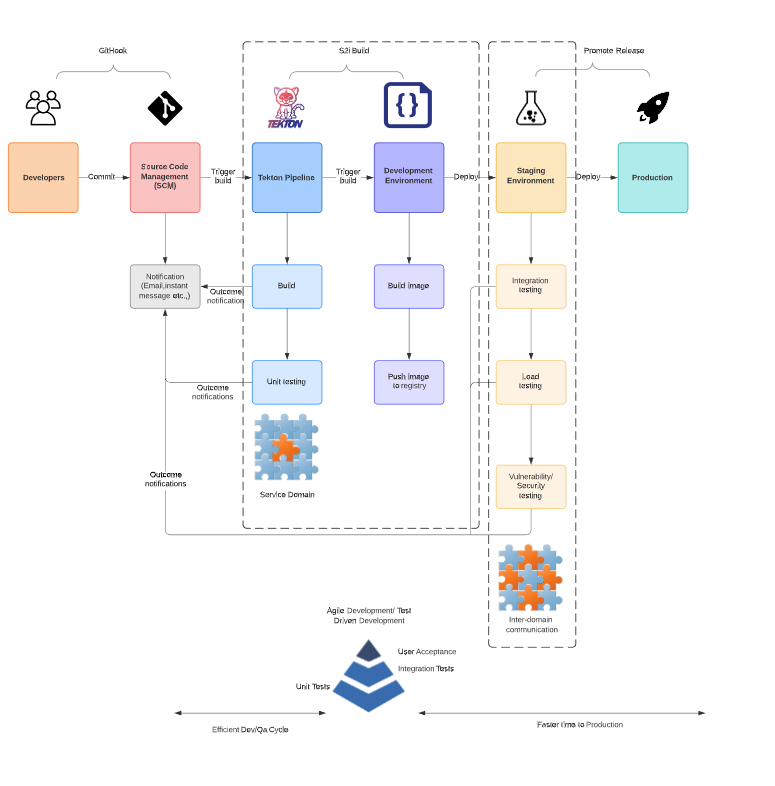
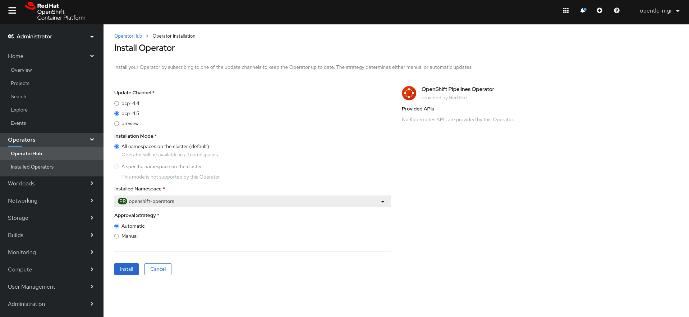
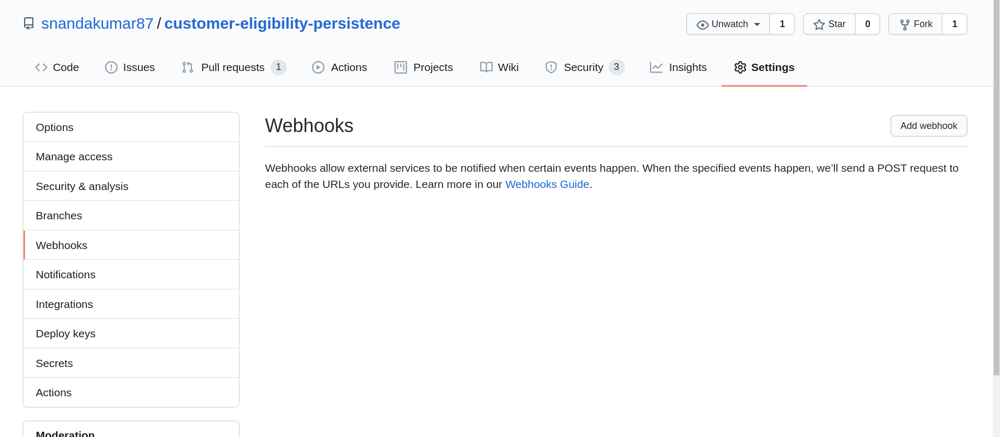

# Pipeline templates for Gitops 

The Service domains are implemented as microservices. These pipeline templates will allow
us to configure GitHooks so that we can push changes in a continous fashion.



## Setup pipeline scripts

+ Create a new project.
```
oc new-project pipelines
```

+ Install the Openshift pipelines operator.



+ Install the scripts for task, pipeline and trigger. 
```
oc create -f service-domain-task.yaml
oc create -f service-domain-pipeline.yaml
oc create -f service-domain-triggers.yaml
oc expose svc/el-service-domain-listener
```
+ This should create a listener, and a route as below
```
http://el-service-domain-listener-pipeline.apps.cluster-002d.002d.example.opentlc.com/
```
+ We will now add this route to the git repository. For this navigate to the repository and add a webhook.
For example on github, navigate to service domain repository->Settings->Webhooks->Add Webhook.



Add the Webhook Url as the listener url and choose the content type as application/json.

+ Now do a commit on the repository and push the changes, the changes should kick off the tekton build on openshift.
