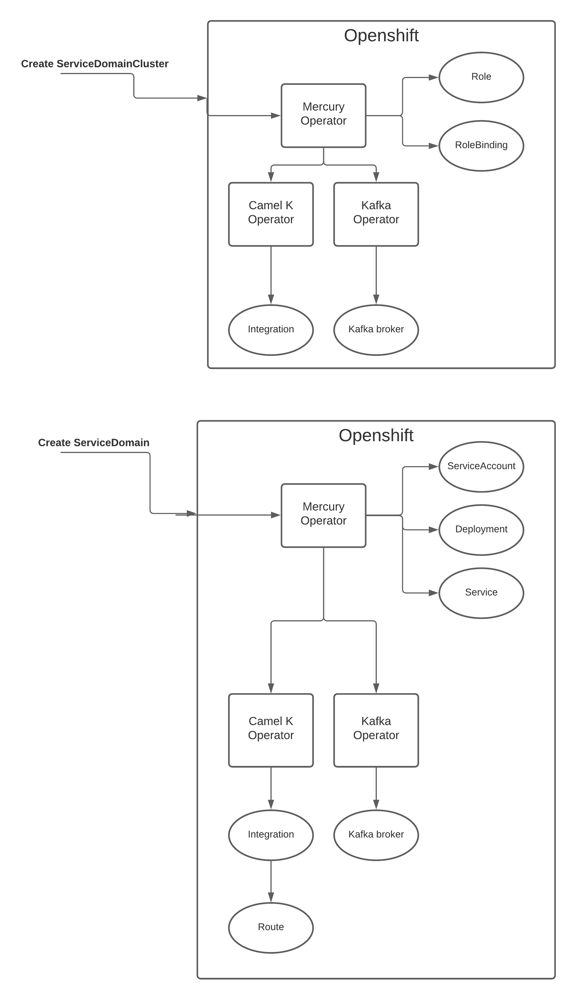

# Mercury Operator (Beta)
## Prerequisites:

- Kafka operator installed (minimum strimzi version 0.26.0)

- Camel-K operator installed (version 1.7.0)

- A ConfigMap per service domain that exposes an http route
(with the name integration-<service-domain-name>-http e.g integration-customer-offer-http)
containing definitions of camel routes(e.g directs.yaml, grpc.yaml, openapi.json)

## Functionality:
This operator is the one responsible for the deployment of the Mercury clusters by creating the necessary objects.
* On Service Domain Cluster object creation the operator will create a Role, a RoleBinding and a Kafka broker in case they do not exist already.
* Upon the successful creation of the Kafka broker, its url will be displayed in the Service Domain Cluster status object.
* On Service Domain object creation the operator will create a ServiceAccount, a Deployment, a Service, a Kafka Topic and a Camel K Integration in case they do not exist already.
* On Service Domain object creation if the expose parameter list has an http value in it, it will create an http Route.
* On Kafka Topic successful creation, its name will be displayed in the Service Domain status.



The Operator is Watching 2 kinds of entities:

##### Service Domain Cluster
The service domain cluster custom resource represents a cluster of service domains with a Kafka broker deployment.
E.g.
```yaml
apiVersion: mercury.redhat.io/v1alpha1
kind: ServiceDomainCluster
metadata:
  name: service-domain-cluster
  labels:
    service-domain-cluster: service-domain-cluster
```

A cluster of service domains consists of a single service domain cluster cr.
To create a service domain cluster run the following command
```shell
oc create -f service-domain-cluster.yaml
```

##### Service Domain
The service domain custom resource represents a service.
```yaml
apiVersion: mercury.redhat.io/v1alpha1
kind: ServiceDomain
metadata:
  name: customer-offer
  labels:
    service-domain: customer-offer
spec:
  businessImage: quay.io/ecosystem-appeng/customer-offer-example:1.0.1
  serviceDomainCluster: service-domain-cluster
  type: CustomerOffer
  expose:
    - http
```
* businessImage - the image to create the service container from.
* serviceDomainCluster - the name of the cluster this service domain is a part of.
* type - the type of the service domain.
* expose - a list of ways this service domain is exposed, currently we support only http, it will create a http route 

To create a service domain run the following command
```shell
oc create -f customer-offer-service-domain.yaml
```
