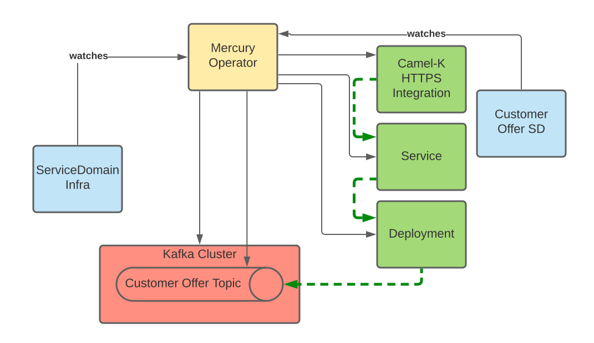

# Mercury Operator (Beta)
## Prerequisites:

- Kafka operator installed (minimum Strimzi version 0.26.x or 0.27.x)
- Camel-K operator installed (version 1.8.x)

## Mercury Resources

### Service Domain Infrastructure

The `ServiceDomainInfra` custom resource represents a set of resources shared by one or many service domains.

e.g.
```yaml
apiVersion: mercury.redhat.io/v1alpha1
kind: ServiceDomainInfra
metadata:
  name: example-service-domain-infra
spec:
  kafka:
    replicas: 3
    storage:
      type: persitent-claim
      size: 10Gi
```

Supported Kafka storage types are:
* `persistent-claim`
* `ephemeral`

You can create an example `ServiceDomainInfra` from the examples folder:

```shell
kubectl create -f examples/crs/my-first-sdi.yaml
```

### Service Domain

The `ServiceDomain` custom resource represents an implementation of a specific Service Domain.
It basically consists of a gRPC service, a deployment and a Kafka Topic managed by the operator. 
If external access is required then use the `expose` parameter, then, the operator will create
the Camel-K resources needed to expose the service through the available endpoints.

At the moment only the `http` endpoint is supported.

```yaml
apiVersion: mercury.redhat.io/v1alpha1
kind: ServiceDomain
metadata:
  name: example-customer-offer
spec:
  businessImage: quay.io/ecosystem-appeng/customer-offer-example:1.0.1-SNAPSHOT
  serviceDomainInfra: example-service-domain-infra
  type: CustomerOffer
  expose:
    - http
```
* businessImage - the image to create the service container from.
* serviceDomainInfra - the name of the service domain infra this service domain is a part of.
* type - the type of the service domain.
* expose - a list of endpoints this service domain is exposed 

You can create an example `ServiceDomain` from the examples folder:

```shell
kubectl create -f examples/crs/my-customer-offer.yaml
```

## Functionality

This operator is responsible for the deployment of the Mercury infrastructure and different services that will
be part of a BIAN ecosystem.

* On `ServiceDomainInfra` object creation the operator will create a ``Kafka` broker.
* Upon the successful creation of the `Kafka` broker, its URL will be displayed in the Service Domain Infra status.
* On `ServiceDomain` object creation, the operator will create a Deployment, a Service and a Kafka Topic.
* If the `ServiceDomain` has to be exposed, it will also create the Camel-K integrations.



## Preparation

### Common

The following resources must be created where the integrations are going to be built.

- A configMap containing a Maven settings, before doing so, export the user/token
  with permissions to READ packages because our integrations depend on custom Maven
  dependencies published on GitHub Packages.

```shell
export GITHUB_USER=my-user
export GITHUB_TOKEN=my-github-token-with-read-packages-permission
SETTINGS=$(sed -e "s/github_user/$GITHUB_USER/" -e "s/github_password/$GITHUB_TOKEN/" ../deploy/config/camel-k/mercury-mvn-settings.xml) && kubectl create cm mercury-mvn-settings --from-literal=settings.xml=$SETTINGS
```

- An Integration Platform pointing to this configMap.

```shell
oc apply -f ../deploy/config/camel-k/integration-platform.yaml
```

### On Minikube

You will require the `registry` addon and then create the IntegrationPlatform
pointing to the local registry. Check the [Camel-K documentation](https://camel.apache.org/camel-k/1.8.x/installation/registry/registry.html)
to set up a different registry

First extract the registry address:

```shell
export REGISTRY_ADDRESS=$(kubectl -n kube-system get service registry -o jsonpath='{.spec.clusterIP}')
```
Then use the existing integration platform definition with your internal registry configuration:

```shell
faq -f yaml -o yaml --args $REGISTRY_ADDRESS '.spec.build.registry = {address: $ARGS.positional[0], insecure: true}' ../deploy/config/camel-k/integration-platform.yaml | kubectl create -f -
```

### On Openshift
Just create the integration platform:

```shell
kubectl apply -f ../deploy/config/camel-k/integration-platform.yaml
```

## Simple Installation

The operator will be created in the mercury namespace so make sure the `mercury` namespace exists.

To install the operator run:

```shell
kubectl apply -n mercury -f ../deploy/
```

## Installation with OLM

We have created a Catalog containing the Mercury Operator. You can install this catalog on the
Operator Lifecycle Manager and then just create a Subscription via the user interface.

```shell
kubectl apply -n olm -f ../deploy/olm-catalog/1.0.2/catalog-source.yaml
```
