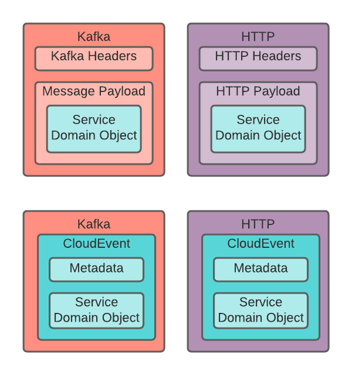

# Proposal: CloudEvents as unified event data format

Currently BIAN semantic APIs are defined using OpenAPI specification. This standard focuses on RESTful APIs and describes a synchronous request-response interaction for each operation.

This pattern becomes a challenge when trying to use an asynchronous, event driven communication between a variety of services where each service will have to decide how to organise the metadata and payload for a request/response depending on the protocol and transport used.

Eventually each implementation will come up with a different event payload that will add an unnecessary complexity to any integration.

## Example RESTful operation

Let's say a service exposing the RESTful API for the Customer Credit Rating service domain receives a `retrieveCustomerCreditRatingStateAlerts` command as follows

* Service Domain: Customer Credit Rating
* Operation: retrieveCustomerCreditRatingStateAlerts
* Summary: Invoke a reporting action to obtain a Alerts instance related report.
* Service Operation: Retrieve
* HTTP Method: `GET`
* HTTP Path: `/customer-credit-rating/{sd-reference-id}/customer-credit-rating-state/{cr-reference-id}/alerts/{bq-reference-id}`

The caller of the service, following with the OpenAPI spec, will expect the following response:

* Status code: 200
* Payload

```json
{
    "customerCreditRatingStateInstanceRecord": {
        "customerReference": "some text"
    },
    "alertsInstanceRecord": {
        "productInstanceReference": "some text",
        "employeeBusinessUnitReference": "some text",
        "customerCreditAlertType": "some text",
        "customerCreditAlertDescription": "some text",
        "date": "some text"
    },
    "alertsRetrieveActionTaskReference": "some text",
    "alertsRetrieveActionTaskRecord": {},
    "alertsRetrieveActionResponse": "some text",
    "alertsInstanceReport": {
        "alertsInstanceReportRecord": {},
        "alertsInstanceReportType": "some text",
        "alertsInstanceReportParameters": "some text",
        "alertsInstanceReport": {}
    },
    "alertsInstanceAnalysis": {
        "alertsInstanceAnalysisRecord": {},
        "alertsInstanceAnalysisReportType": "some text",
        "alertsInstanceAnalysisParameters": "some text",
        "alertsInstanceAnalysisReport": {}
    }
}
```

There is little margin for converting this sequence into an asynchronous response in case this processing requires some manual interaction or to communicate with other services that have a delayed processing.

## The proposed solution

[CloudEvents](https://github.com/cloudevents/spec) is a CNCF specification for describing event data in common formats to provide interoperability across services, platforms and systems.

Mapping each incoming and outgoing message for each RESTful operation defined in the BIAN Semantic APIs will allow to decouple the protocol from the message enabling any type of communication pattern.

Moreover by using an agreed CloudEvent structure as the payload, the conversion between different transports will become much easier.



### Mapping a RESTful operation to a CloudEvent

Given a RESTful operation we can uniquely map it to a CloudEvent and vice-versa.

The HTTP method together with the request path identifies the service domain, the control record, the behavior qualifiers and the service operation:

Taking the previous operation as example the following mapping can be defined:

```bash
GET /customer-credit-rating/sd-ref-001/customer-credit-rating-state/cr-ref-001/alerts/bq-ref-001
```

* Service Domain: Customer Credit Rating
* Control Record: State
* Behavior Qualifier: Alerts
* Service Operation: Retrieve

This could be converted into a CloudEvent like this:

```json
{
    "specversion": "1.0",
    "id": "c6ca6b2f-78be-48ed-a68b-fdaecd20082a",
    "source": "com.example/my-example-service",
    "type": "org.bian.customercreditrating.state.alerts.retrieve",
    "biansdrefid": "sd-ref-001",
    "biancrrefid": "cr-ref-001",
    "bianbqrefid": "bq-ref-001"
}

```

And the result, when available, can be either returned immediately or asynchronously to a predefined endpoint, broker or distribution source where any interested service might be notified from. The result event can be as follows:

```json
{
    "specversion": "1.0",
    "id": "c6ca6b2f-78be-48ed-a68b-fdaecd20082a",
    "source": "http://customercreditrating-svc.acme.com/",
    "type": "org.bian.customercreditrating.state.alerts.retrieve.BQAlertsRetrieveOutput",
    "biansdrefid": "sd-ref-001",
    "biancrrefid": "cr-ref-001",
    "bianbqrefid": "bq-ref-001",
    "data": {
        "customerCreditRatingStateInstanceRecord": {
            "customerReference": "some text"
        },
        "alertsInstanceRecord": {
            "productInstanceReference": "some text",
            "employeeBusinessUnitReference": "some text",
            "customerCreditAlertType": "some text",
            "customerCreditAlertDescription": "some text",
            "date": "some text"
        },
        "alertsRetrieveActionTaskReference": "some text",
        "alertsRetrieveActionTaskRecord": {},
        "alertsRetrieveActionResponse": "some text",
        "alertsInstanceReport": {
            "alertsInstanceReportRecord": {},
            "alertsInstanceReportType": "some text",
            "alertsInstanceReportParameters": "some text",
            "alertsInstanceReport": {}
        },
        "alertsInstanceAnalysis": {
            "alertsInstanceAnalysisRecord": {},
            "alertsInstanceAnalysisReportType": "some text",
            "alertsInstanceAnalysisParameters": "some text",
            "alertsInstanceAnalysisReport": {}
        }
    }
}
```

## RESTFul API to CloudEvent Mapping

### The `type` parameter

The most important part of a CloudEvent is the `type` attribute that is usually used for filtering. Other attributes might be used for filtering as well but might not be supported by all solutions.

The proposed `type` attribute format is:

`org.bian.<service-domain>.<control-record>.[<behavior-qualifier>].<service-operation>[.<object-type>]`

Examples:

```yaml
# RESTful Request
GET /customer-credit-rating/{sd-reference-id}/customer-credit-rating-state/{cr-reference-id}/alerts/{bq-reference-id}
# CloudEvent request
org.bian.customer-credit-rating.state.alerts.retrieve
# CloudEvent response
org.bian.customer-credit-rating.state.alerts.retrieve.BQAlertsRetrieveOutput
```

```yaml
# RESTful Request
PUT /customer-credit-rating/{sd-reference-id}/customer-credit-rating-state/{cr-reference-id}/internalreporting/{bq-reference-id}/capture
# CloudEvent request
org.bian.customer-credit-rating.state.internalreporting.capture.BQInternalReportingCaptureInput
# CloudEvent response
org.bian.customer-credit-rating.state.internalreporting.capture.BQInternalReportingCaptureOutput
```

### Context attributes

CloudEvents support the use of custom context attributes similar to custom HTTP headers
that are context specific, in this case, for BIAN the following attributes are proposed:

* `biansdrefid`: Servicing Session Reference
* `biancrrefid`: Control Record Instance Reference
* `bianbqrefid`: Behavior Qualifier Instance Reference
* `bianqueryfilter`: Filter to refine the result set. e.g. `Status = 'pending'`

These context attributes are extracted from the path and query parameters.
